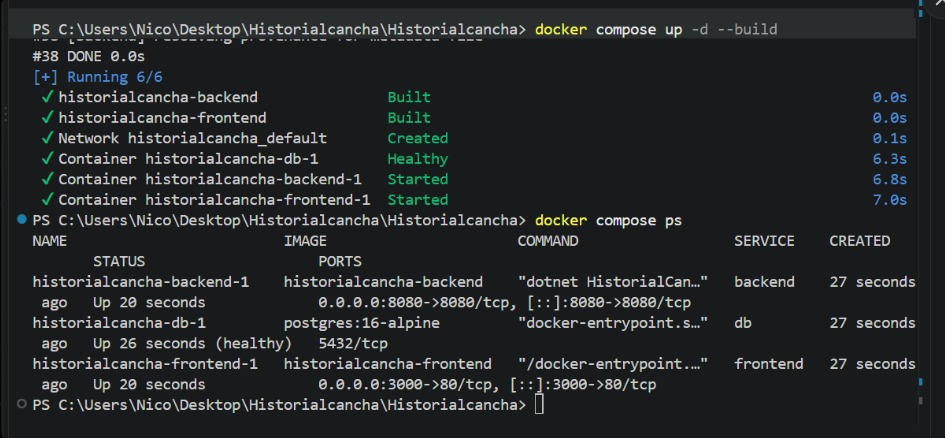
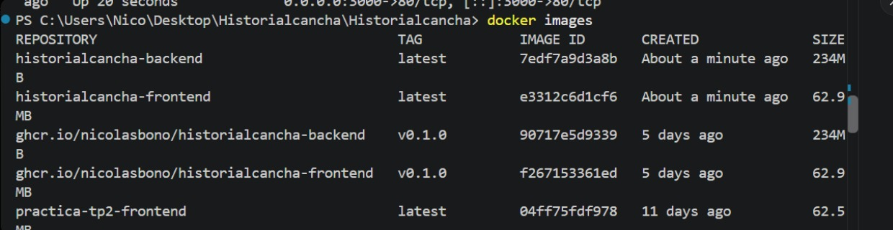
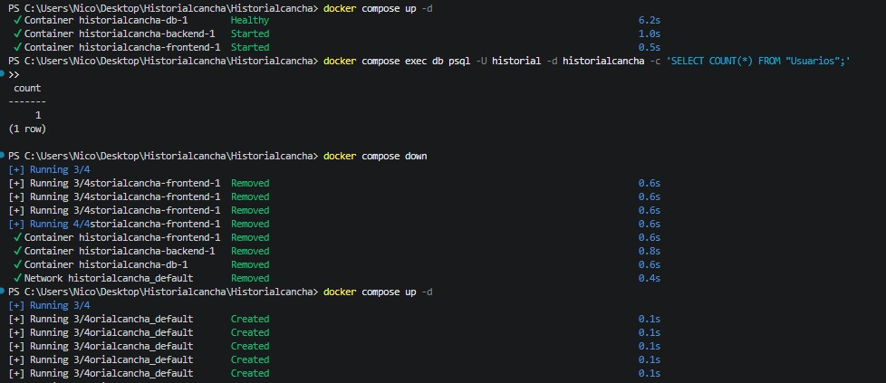
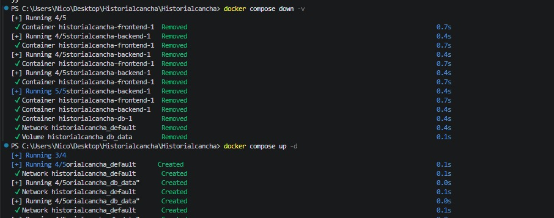
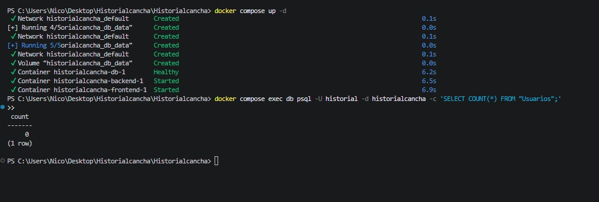
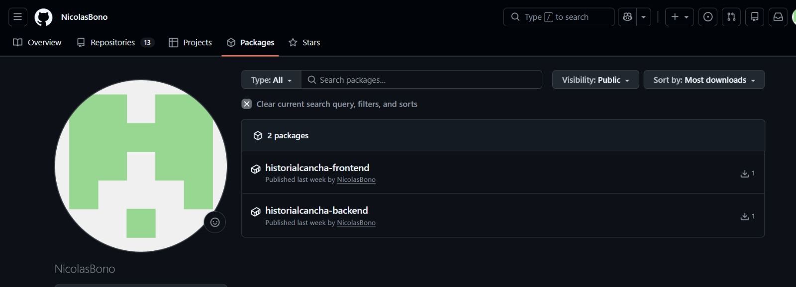
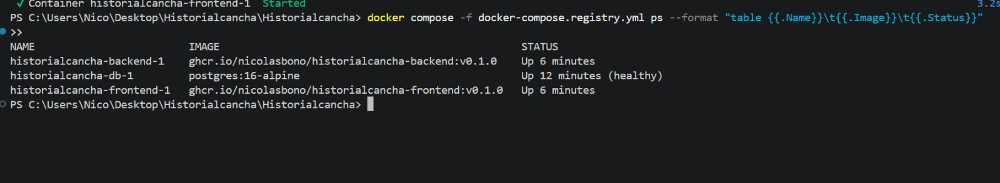

# Evidencias

## TP1 — Git colaborativo

### Captura 1 — Push directo a main

en esta captura vemos como se realizo con exito la configuracion del repo ya que no me dejo subir un cambio directo a la main ya que configuramos que tenia que ser a travez de un pr

### Captura 2 — Conflicto de merge (1)

### Captura 3 — Conflicto de merge (2)

 en la captura 2 y 3 podemos ver como 2 ramas tienen conflicto ya que modificamos la misma linea entonces no te deja subir ya que no sabe cual es la que esta bien porque cuando se hizo el pr no se habia mergeado la otra rama entonces antes de mergear con el main tenemos que resollver ese conflicto y ver que ponemos en la linea que se superpone

### Captura 4 — Release

aca vemos como el release quedo subido con el tag v1.0.0

---

## TP2 — Contenedores y Compose

aca dejo las evidencias de que el sistema contenerizado anda: que levanta de cero, que los datos persisten, que la imagen quedo chica por el multi stage, y que las imagenes estan publicadas en el registry.

### Captura 5 — Levanto todo de cero y funciona end to end
con un docker compose up -d --build me levanta los 3 servicios (front, back y base). en el docker compose ps se ve que la base queda healthy antes de que arranque el backend, y despues le pego un curl al health y me responde ok tanto por el backend directo (8080) como por el proxy de nginx (3000). que responda igual por el 3000 prueba que nginx encontro al backend por el nombre en la red interna, y el baseDeDatos ok prueba que el backend habla con la base y aplico las migraciones al arrancar.

### Captura 6 — Tamaño de la imagen: la prueba del multi stage
aca comparo los tamaños con docker images. la imagen del sdk que compila pesa alrededor de 850mb, pero mi imagen final del backend pesa como 234mb porque no se lleva el sdk ni el compilador, solo el runtime. o sea me ahorro un monton de espacio y de paso queda mas segura porque adentro no hay herramientas de mas.

### Captura 7 — Prueba de persistencia
para probar la persistencia cuento cuantos usuarios hay en la base antes y despues de apagar. tenia 1 usuario cargado.

primero cuento y me da 1, y despues hago docker compose down (sin el -v): fijate que saca los contenedores y la red pero NO toca el volumen, y vuelvo a levantar con up.

despues hago docker compose down -v, y ahi si, ademas de los contenedores, saca el volumen db_data (se ve la linea "Volume historialcancha_db_data Removed"), y vuelvo a levantar.

cuando cuento de nuevo despues del -v me da 0, o sea la base quedo vacia. eso muestra que down apaga pero down -v ademas borra el volumen con los datos, que es lo unico que no es descartable.

### Captura 8 — Imagenes publicadas en el registry
aca se ven las dos imagenes (back y front) publicadas en ghcr.io con el tag v0.1.0 y en visibilidad publica. las subi con docker push despues de taggearlas.

### Captura 9 — El sistema levantado desde el registry, sin el codigo
como prueba fuerte hice logout de ghcr y borre las imagenes locales, y despues con el docker-compose.registry.yml el pull me bajo todo del registry como anonimo (eso prueba que quedaron publicas) y el sistema levanto igual, esta vez usando image en vez de build, o sea sin tener el codigo fuente.

---

### Uso de ia
me ayudo a cargar en la imagen los partidos de boca del apertura, tambien me ayudo a hacer las pruebas cuando ya habia subido la imagen para ver si se creaba bien y traia los datos
