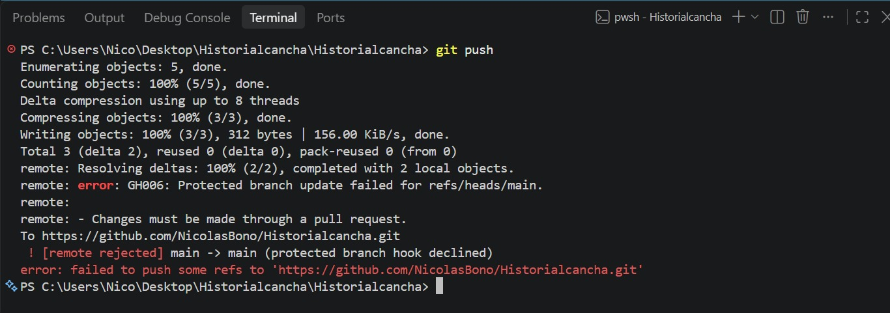
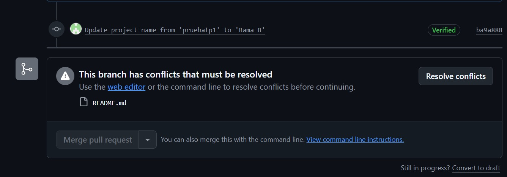
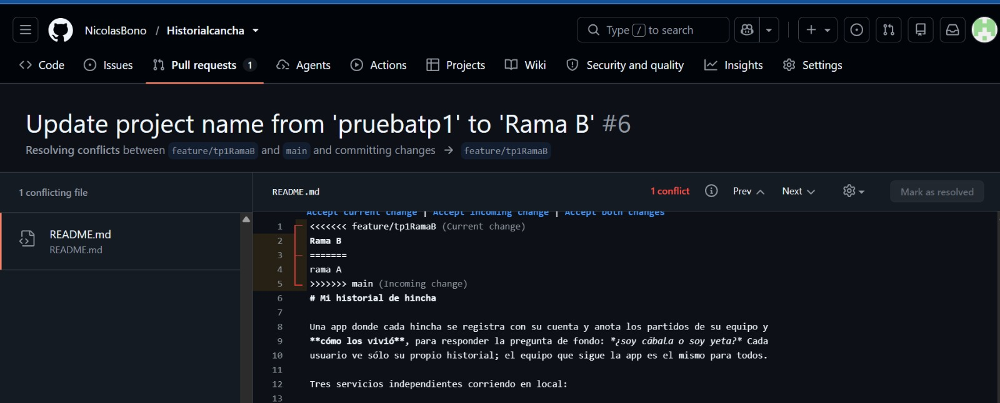
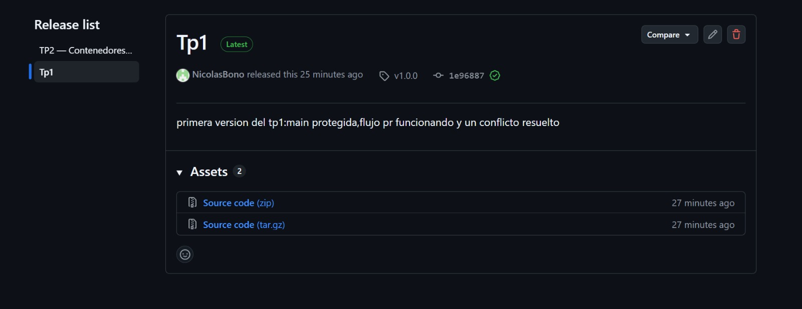

# Evidencias

## TP1 — Git colaborativo

### Captura 1 — Push directo a main

en esta captura vemos como se realizo con exito la configuracion del repo ya que no me dejo subir un cambio directo a la main ya que configuramos que tenia que ser a travez de un pr

### Captura 2 — Conflicto de merge (1)


### Captura 3 — Conflicto de merge (2)

 en la captura 2 y 3 podemos ver como 2 ramas tienen conflicto ya que modificamos la misma linea entonces no te deja subir ya que no sabe cual es la que esta bien porque cuando se hizo el pr no se habia mergeado la otra rama entonces antes de mergear con el main tenemos que resollver ese conflicto y ver que ponemos en la linea que se superpone

### Captura 4 — Release

aca vemos como el release quedo subido con el tag v1.0.0

---

## TP2 — Contenedores y Compose

### Estado

Sistema **construido, levantado y verificado end-to-end** con Docker Desktop
(Docker 28.3.2, WSL2). El bloqueo original —`SVM Mode` deshabilitado en el firmware, que
dejaba a WSL en versión 1— se resolvió habilitando la virtualización en la BIOS; la distro
`docker-desktop` quedó en WSL 2 y el motor levanta contenedores sin problema.

### Archivos entregados

| Archivo | Qué resuelve |
|---|---|
| `backend/Dockerfile` | Multi-stage: `sdk:9.0` compila, `aspnet:9.0` ejecuta. Corre como `USER app` |
| `backend/.dockerignore` | Excluye `**/bin/`, `**/obj/` y los `appsettings.Development.json` con credenciales |
| `frontend/Dockerfile` | Multi-stage: prepara el sitio y genera `js/config.js`; `nginx:alpine` lo sirve |
| `frontend/.dockerignore` | Excluye el `js/config.js` de la máquina local |
| `frontend/nginx.conf` | Sirve los estáticos y proxea `/api/` a `backend:8080` |
| `docker-compose.yml` | Los tres servicios, red interna, volumen nombrado y healthcheck |
| `docker-compose.registry.yml` | El mismo sistema con `image:` en vez de `build:` |
| `.env.example` | Plantilla versionada; el `.env` real está en `.gitignore` |

### Validación del compose (ya hecha)

```
$ docker compose config --quiet
$ echo $?
0
```

### Levantar el sistema

```bash
cp .env.example .env          # y editarlo con valores reales
docker compose up -d --build
```

```text
$ docker compose ps
NAME                         IMAGE                      SERVICE    STATUS
historialcancha-backend-1    historialcancha-backend    backend    Up 11 seconds
historialcancha-db-1         postgres:16-alpine         db         Up 18 seconds (healthy)
historialcancha-frontend-1   historialcancha-frontend   frontend   Up 11 seconds
```

La `db` pasa a `healthy` **antes** de que arranque el backend (`condition: service_healthy`):
la diferencia entre "el contenedor arrancó" y "el servicio está listo".

**1. Tamaños de imagen — la prueba de que el multi-stage sirve**

```text
$ docker images --format 'table {{.Repository}}:{{.Tag}}\t{{.Size}}'
mcr.microsoft.com/dotnet/sdk:9.0       851MB     ← la que COMPILA (no viaja a prod)
mcr.microsoft.com/dotnet/aspnet:9.0    224MB     ← la que sólo EJECUTA
historialcancha-backend:latest         234MB     ← la mía = runtime + ~10MB de app
historialcancha-frontend:latest        62.9MB    ← nginx:alpine + estáticos
postgres:16-alpine                     294MB
```

La imagen final del backend pesa **234MB**, no 851MB+: al no empaquetar el SDK se ahorran
unos **~617MB** y desaparecen compilador y herramientas (menos superficie de ataque).

**2. Sistema funcionando end-to-end (el proxy de nginx)**

```text
$ curl -s localhost:8080/api/health          # backend directo
{"status":"ok","version":"1.0.0","entorno":"Production","baseDeDatos":"ok","miEquipo":"Boca Juniors"}

$ curl -s localhost:3000/api/health          # por el proxy de nginx
{"status":"ok","version":"1.0.0","entorno":"Production","baseDeDatos":"ok","miEquipo":"Boca Juniors"}
```

**Misma respuesta por los dos puertos**: la del 3000 prueba que nginx resolvió `backend:8080`
por la red interna de compose (DNS por nombre de servicio). Y `baseDeDatos:"ok"` confirma
que el backend habla con `db` y que las migraciones se aplicaron al arrancar.

**3. Persistencia — la prueba del volumen**

Con un usuario y 17 partidos cargados (el Apertura 2026 de Boca):

```text
# --- restart SIN -v: el volumen se conserva ---
$ docker compose down && docker compose up -d
$ docker compose logs backend | grep migraciones
   No migrations were applied. The database is already up to date.   ← el esquema sobrevivió
$ curl -s -X POST localhost:3000/api/auth/login -d '{"dni":"45594221","contrasena":"..."}'
   → token emitido      (LOGIN OK: el usuario persistió)
$ curl -s localhost:3000/api/partidos -H "Authorization: Bearer <token>"
   → 17 partidos        (los datos siguen ahí)

# --- restart CON -v: el volumen se borra ---
$ docker compose down -v && docker compose up -d
$ curl -s -X POST localhost:3000/api/auth/login -d '{"dni":"45594221","contrasena":"..."}'
   {"error":"DNI o contraseña incorrectos.","regla":"credenciales-invalidas"}   ← base vacía
```

`down` apaga; `down -v` **además olvida**. Los contenedores se recrean sin costo; el estado
vive en el volumen `db_data` y es lo único que no es descartable.

**4. Publicación en el registry (ghcr.io)**

```bash
echo $CR_PAT | docker login ghcr.io -u nicolasbono --password-stdin
docker tag historialcancha-backend  ghcr.io/nicolasbono/historialcancha-backend:v0.1.0
docker tag historialcancha-frontend ghcr.io/nicolasbono/historialcancha-frontend:v0.1.0
docker push ghcr.io/nicolasbono/historialcancha-backend:v0.1.0
docker push ghcr.io/nicolasbono/historialcancha-frontend:v0.1.0
```

Digests publicados:

```text
backend  v0.1.0: digest: sha256:e869deee7796f2401cb4f89a5bdbe192c42f78fb27224cccd13adcbaba127e3e  size: 1997
frontend v0.1.0: digest: sha256:8ba6abe41b68b80efea134433ab976cfcbf7c1a808c9bffa6b923f8f89f5c8d9  size: 2405
```

Packages (visibilidad **Public**):
- https://github.com/users/nicolasbono/packages/container/package/historialcancha-backend
- https://github.com/users/nicolasbono/packages/container/package/historialcancha-frontend

⚠️ Gotcha real de esta corrida: el primer token daba `Login Succeeded` pero el push fallaba
con `denied: permission_denied: The token provided does not match expected scopes.` — le
faltaba el scope **`write:packages`**. Con un token **classic** con ese permiso tildado,
push OK. El `<usuario>` va en minúsculas.

**5. El sistema desde el registry, sin código fuente**

Prueba fuerte: `logout` de ghcr + borrado de las imágenes locales, para que el `pull` baje
todo del registry **como anónimo** (así se prueba que quedaron públicas):

```text
$ docker logout ghcr.io
$ docker rmi ghcr.io/nicolasbono/historialcancha-backend:v0.1.0 ghcr.io/nicolasbono/historialcancha-frontend:v0.1.0
$ docker compose -f docker-compose.registry.yml pull
  backend Pulled
  frontend Pulled            ← bajadas de ghcr sin login: son públicas
  db Pulled

$ docker compose -f docker-compose.registry.yml up -d
$ docker compose -f docker-compose.registry.yml ps --format 'table {{.Name}}\t{{.Image}}\t{{.Status}}'
NAME                         IMAGE                                                 STATUS
historialcancha-backend-1    ghcr.io/nicolasbono/historialcancha-backend:v0.1.0    Up (healthy deps)
historialcancha-db-1         postgres:16-alpine                                    Up (healthy)
historialcancha-frontend-1   ghcr.io/nicolasbono/historialcancha-frontend:v0.1.0   Up

$ curl -s localhost:3000/api/health
{"status":"ok","version":"1.0.0","entorno":"Production","baseDeDatos":"ok","miEquipo":"Boca Juniors"}
```

El `ps` muestra `image: ghcr.io/...`, no `build:`: el sistema levanta desde las imágenes
publicadas, sin el código fuente. Como no se usó `-v`, los 17 partidos siguieron en el
volumen incluso al cambiar las imágenes por las del registry.

---

### Nota — datos de demo cargados

La base tiene un usuario (`Nico Bono`, DNI 45594221) con los **17 partidos del Torneo
Apertura 2026 de Boca** (fechas 1–16 + Octavos vs Huracán). Récord: 17 jugados, 8G-6E-3D,
24 GF/12 GC, 30 puntos, 58.8% de efectividad. Los resultados salen de fuentes web
(ESPN/PlanetaBJ); la modalidad (cancha/TV) es un default editable desde la app.

⚠️ Estos datos viven en el **volumen**, no en la imagen: quien haga `pull` de la imagen
publicada y levante el compose obtiene la base **vacía** (las migraciones crean el esquema,
no los datos). Es demo local, no "viaja" con la imagen.

Uso de ia: me ayudo a cargar en la imagen los partidos de boca del apertura,tambien me ayudo a hacer las pruebas cuando ya habia subido la imagen para ver si se creaba bien y traia los datos 

